# Customer Churn Insights

End-to-end data science project with an interactive Streamlit web dashboard for customer churn prediction, model comparison, explainability, and retention recommendations.

## Business Question

Which customers are most likely to churn, what factors drive churn risk, and which retention actions should the business prioritize?

## Project Goals

- Explore churn patterns in the Telco Customer Churn dataset.
- Build a reproducible preprocessing and modeling pipeline.
- Compare a simple baseline, interpretable models, and tree-based classifiers.
- Evaluate models with metrics that reflect a retention use case.
- Explain churn drivers with permutation importance and SHAP.
- Save the best model for reusable predictions.
- Translate model results into practical business recommendations.
- Provide an interactive web dashboard for non-technical stakeholders.

## Dataset

Dataset: IBM Telco Customer Churn sample dataset.

Expected local file location:

```text
data/raw/telco_customer_churn.csv
```

The raw dataset is not committed to the repository. Add the CSV locally before running the pipeline. The dataset source is the IBM `telco-customer-churn-on-icp4d` repository, which is published under the Apache-2.0 license.

Current dataset shape:

```text
Rows: 7043
Columns: 21
Churn rate: 26.54%
```

## Streamlit Web Dashboard

The project includes an interactive Streamlit web dashboard for exploring the churn model in a browser. It is designed as a desktop analytics tool rather than a mobile app.

The dashboard supports:

- single-customer churn-risk prediction
- probability-based risk labels
- model-performance comparison
- EDA visuals
- permutation importance and SHAP explainability
- retention-action recommendations

Run it locally with:

```bash
streamlit run app/streamlit_app.py
```

## Dashboard Screenshots

### Prediction View

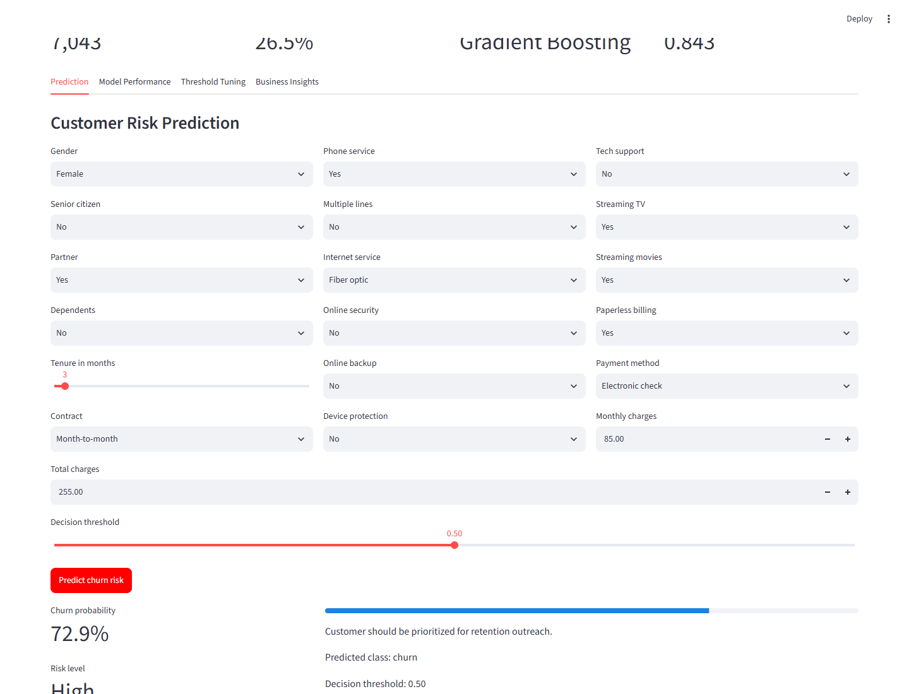

### Model Performance View

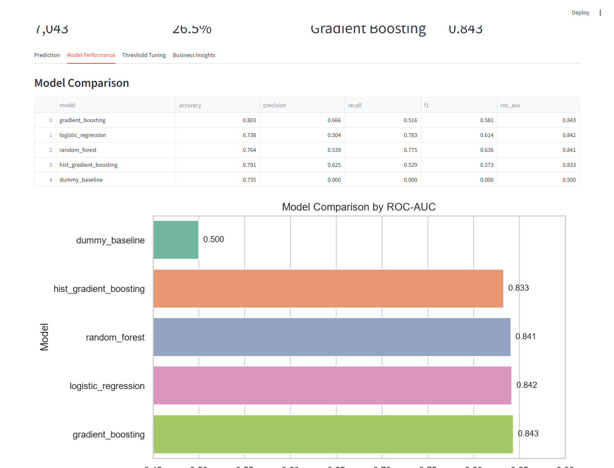

### Threshold Tuning View

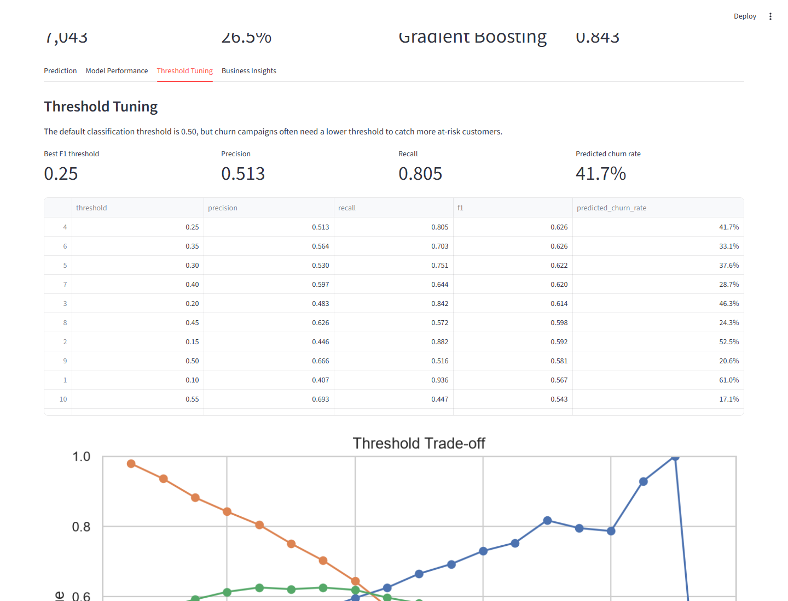

### Business Insights View

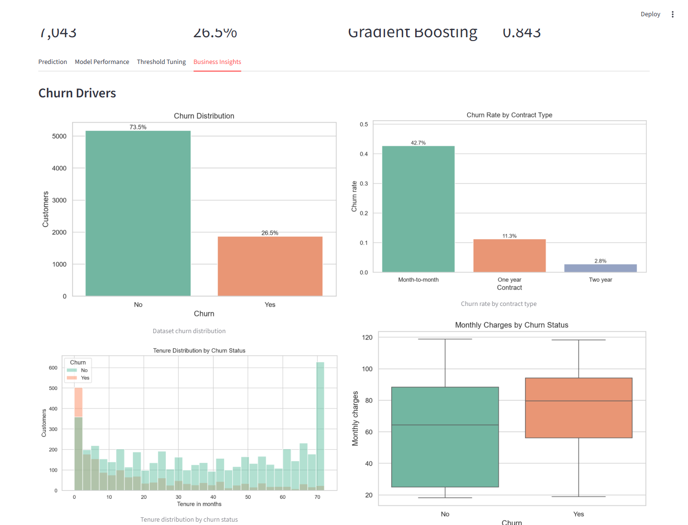

## PDF Reports

Additional dashboard exports are available as PDF files:

- [Customer Risk Prediction](reports/pdfs/customer_churn_insights_customer_risk_prediction.pdf)
- [Model Comparison](reports/pdfs/customer_churn_insights_model_comparison.pdf)
- [Threshold Tuning](reports/pdfs/customer_churn_insights_threshold_tuning.pdf)
- [Business Insights](reports/pdfs/customer_churn_insights_business_insights.pdf)
## Key Visuals

### Churn Distribution

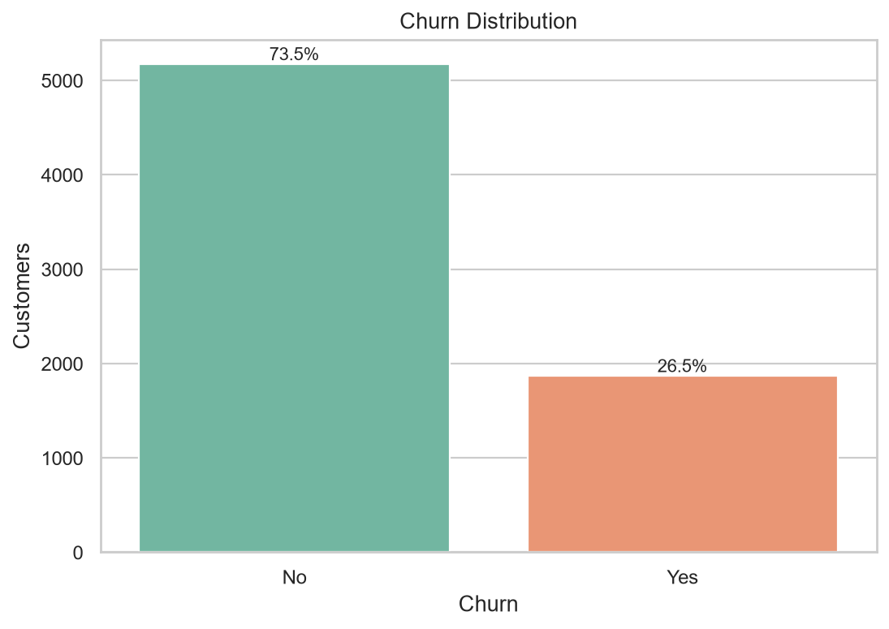

### Churn Rate by Contract Type

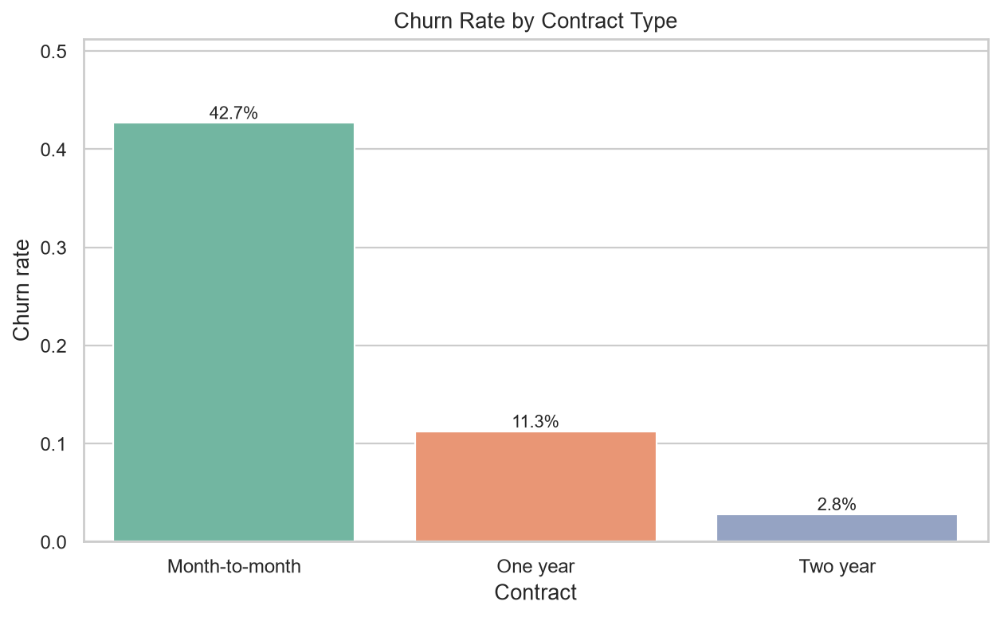

### Model Comparison

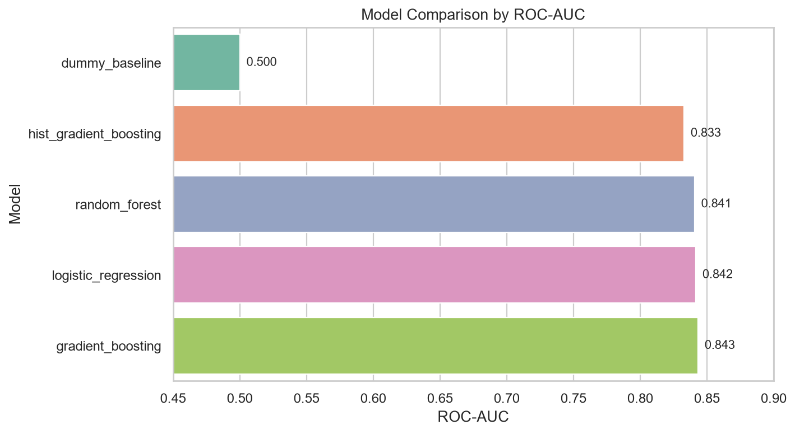

### Evaluation Curves

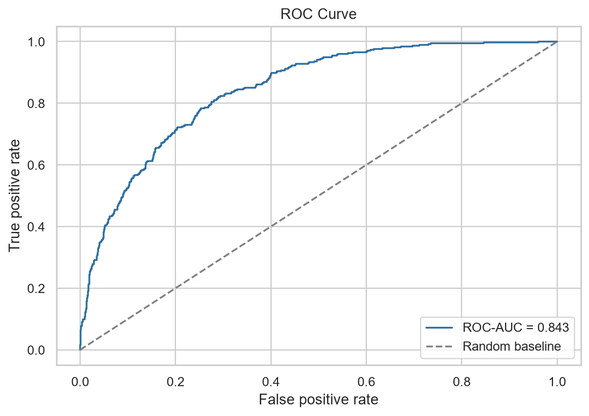

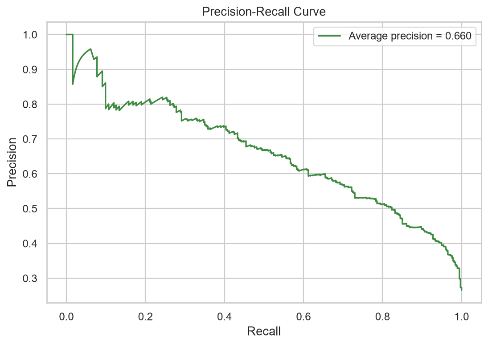

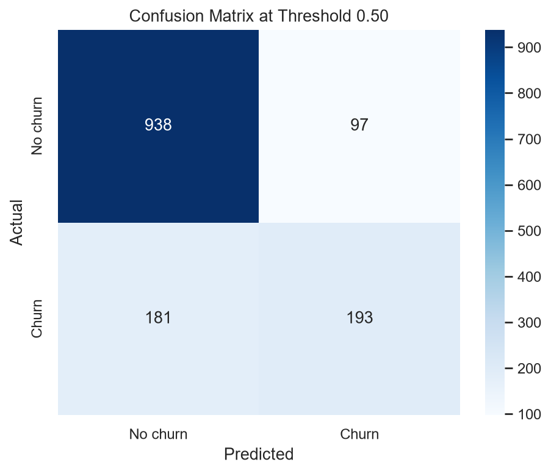

### Threshold Trade-off

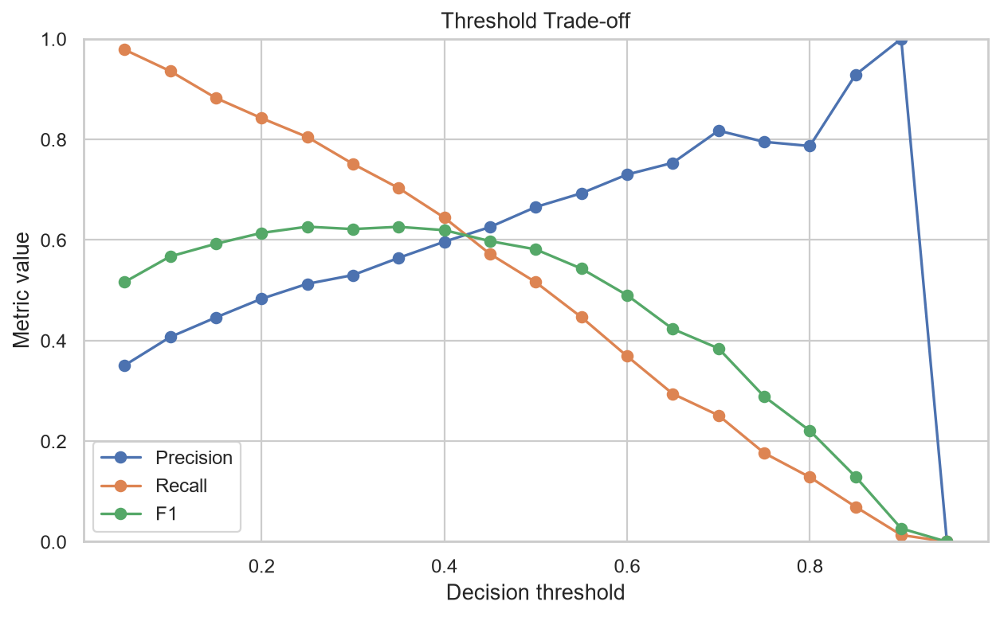

### Feature Importance

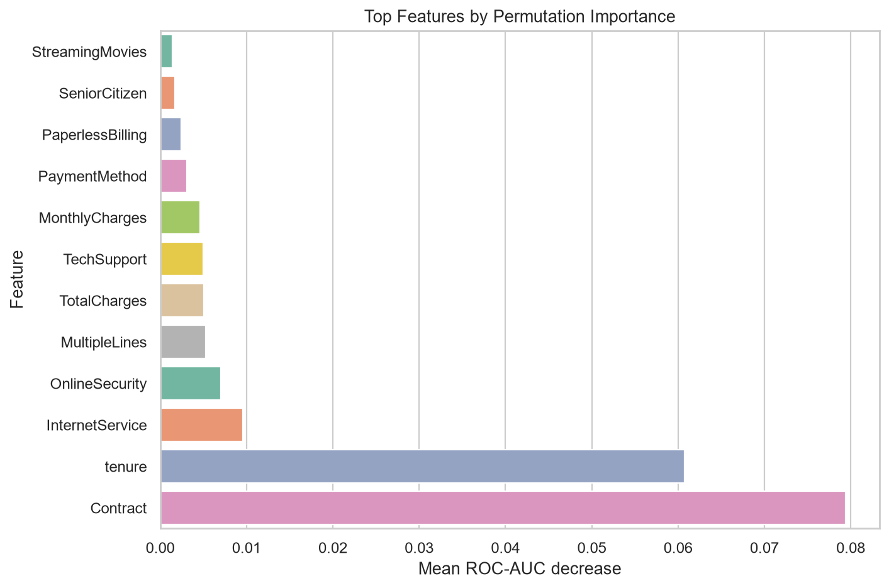

### SHAP Summary

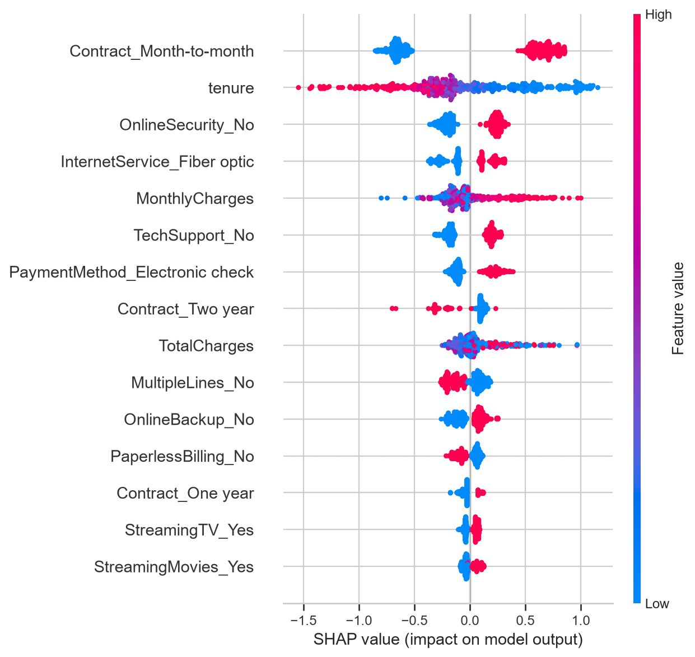

## Repository Structure

```text
customer-churn-insights/
|-- app/
|   `-- streamlit_app.py
|-- data/
|   |-- raw/
|   `-- processed/
|-- models/
|   `-- churn_model.joblib
|-- notebooks/
|   `-- 01_eda.ipynb
|-- reports/
|   |-- figures/
|   |-- pdfs/
|   |-- screenshots/
|   |-- model_comparison.csv
|   |-- permutation_importance.csv
|   `-- threshold_analysis.csv
|-- scripts/
|   |-- capture_dashboard_screenshots.py
|   |-- generate_reports.py
|   `-- predict_example.py
|-- src/
|   |-- data.py
|   |-- evaluate.py
|   |-- explain.py
|   |-- features.py
|   `-- train.py
|-- tests/
|-- .gitignore
|-- README.md
`-- requirements.txt
```

## Modeling Approach

The project trains and compares five classifiers:

- Dummy Baseline
- Logistic Regression
- Random Forest
- Gradient Boosting
- Hist Gradient Boosting

The preprocessing and model are wrapped in a single scikit-learn pipeline. This keeps training and prediction consistent:

- numeric features are imputed and scaled
- categorical features are imputed and one-hot encoded
- the classifier is trained on the transformed feature matrix

## Model Results

Evaluation is based on an 80/20 stratified train-test split with `random_state=42`.

| Model | Accuracy | Precision | Recall | F1 | ROC-AUC |
|---|---:|---:|---:|---:|---:|
| Gradient Boosting | 0.803 | 0.666 | 0.516 | 0.581 | 0.843 |
| Logistic Regression | 0.738 | 0.504 | 0.783 | 0.614 | 0.842 |
| Random Forest | 0.764 | 0.539 | 0.775 | 0.636 | 0.841 |
| Hist Gradient Boosting | 0.791 | 0.625 | 0.529 | 0.573 | 0.833 |
| Dummy Baseline | 0.735 | 0.000 | 0.000 | 0.000 | 0.500 |

The full comparison is saved in:

```text
reports/model_comparison.csv
```

## Model Selection

The selected model is:

```text
Gradient Boosting
```

It achieved the highest ROC-AUC on the test set. This means it performed best overall at ranking customers by churn risk.

However, model choice depends on the business objective:

- If the goal is the best overall ranking of churn risk, Gradient Boosting is the strongest current choice.
- If the goal is to catch as many potential churners as possible, Logistic Regression and Random Forest currently have much higher recall.
- If retention campaigns are expensive, higher precision may be more important than recall.

For a real retention campaign, threshold tuning is important: instead of using the default 0.50 cutoff, choose a probability threshold that balances campaign cost against expected saved revenue. In the current test split, the best F1 score is reached at threshold 0.25, with precision 0.513 and recall 0.805. This lower threshold catches many more potential churners, but it also increases the number of customers targeted by a campaign.

## Threshold Tuning

The selected model outputs churn probabilities. Turning those probabilities into a churn/no-churn decision requires a threshold.

The default threshold of 0.50 gives higher precision but misses more churners. A lower threshold improves recall, which can be preferable when the business wants to proactively contact more at-risk customers.

Current best F1 threshold:

| Threshold | Precision | Recall | F1 | Predicted Churn Rate |
|---:|---:|---:|---:|---:|
| 0.25 | 0.513 | 0.805 | 0.626 | 41.7% |

The full threshold table is saved in:

```text
reports/threshold_analysis.csv
```
## Explainability

Permutation importance identifies the strongest original input features for the selected model:

| Rank | Feature | Mean ROC-AUC Decrease |
|---:|---|---:|
| 1 | Contract | 0.079 |
| 2 | tenure | 0.061 |
| 3 | InternetService | 0.010 |
| 4 | OnlineSecurity | 0.007 |
| 5 | MultipleLines | 0.005 |
| 6 | TotalCharges | 0.005 |
| 7 | TechSupport | 0.005 |
| 8 | MonthlyCharges | 0.005 |
| 9 | PaymentMethod | 0.003 |
| 10 | PaperlessBilling | 0.002 |

The full feature-importance table is saved in:

```text
reports/permutation_importance.csv
```

The SHAP summary plot provides a more detailed view of how encoded feature values influence individual predictions.

## Example Prediction

After training, the best model is saved as:

```text
models/churn_model.joblib
```


Run an example prediction:

```bash
python scripts/predict_example.py
```

Example output with the current selected model:

```text
Example customer churn prediction
Prediction: 1 (churn)
Churn probability: 72.85%
Risk level: high
```

## Business Interpretation

Initial model behavior is consistent with common churn hypotheses:

- Contract type is the strongest current churn-risk driver.
- Short-tenure customers are higher risk.
- Internet service type and support/security services provide meaningful churn signals.
- Monthly and total charges contribute to risk, but are less dominant than contract and tenure.
- Payment method and paperless billing also add predictive signal.

Potential retention actions:

- Prioritize high-risk customers with short tenure and month-to-month contracts.
- Offer targeted discounts or plan reviews to high-charge customers.
- Promote support, security, or backup add-ons to increase engagement.
- Build a retention campaign around customers with high churn probability and high customer value.

## License and Attribution

This repository is intended as a public portfolio project for data-science job applications.

- Project code: MIT License, see `LICENSE`.
- Dataset source: IBM Telco Customer Churn sample dataset from `IBM/telco-customer-churn-on-icp4d`, licensed under Apache-2.0.
- Raw data: not redistributed in this repository; users should add the CSV locally under `data/raw/telco_customer_churn.csv`.
- Third-party Python packages: installed via `requirements.txt`; package source code is not vendored into this repository.

Dataset repository: https://github.com/IBM/telco-customer-churn-on-icp4d

## How to Run

Create and activate a virtual environment, then install dependencies:

```bash
python -m venv .venv
.venv\Scripts\activate
pip install -r requirements.txt
```

Run tests:

```bash
pytest
```

Train and compare models:

```bash
python -m src.train
```

Generate report figures and explainability outputs:

```bash
python scripts/generate_reports.py
```

Capture dashboard screenshots for the README:

```bash
python scripts/capture_dashboard_screenshots.py
```

Run an example prediction:

```bash
python scripts/predict_example.py
```

Run the Streamlit dashboard:

```bash
streamlit run app/streamlit_app.py
```

## Next Steps

- Expand exploratory data analysis in `notebooks/01_eda.ipynb`.


